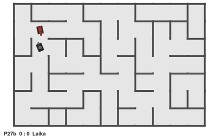
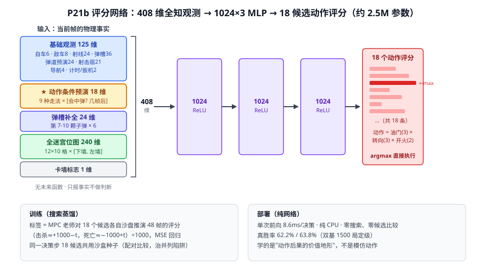

[](README.md)
[](README.zh-CN.md)

# Tank Trouble AI

A line-by-line Python port of the Flash game **Tank Trouble**, and a full study of
one question on top of it:

> **Can an AI learn to beat a hand-written game AI on its own — how far can it get,
> and which method actually works?**

The opponent is **Laika**, the original game's scripted bot (~980 lines, dodges every
bullet, 10-frame decision cycle). It is strong: Laika mirrored against itself only
scores **40.2%** true win rate, because in this game killing first is not the same as
winning.

The current deployed agent is a **pure feed-forward network with zero online search**
that wins **88.7%** of games against Laika, at 8.6 ms per decision. A privileged
offline search teacher reaches **99.0%**.

Everything is reproducible: the engine is dependency-free Python, runs headless at
6000+ frames/sec, and is seed-deterministic.



<sub>P27b (red) vs Laika (black), real speed, seeds 970005 / 970019 / 970004.
Note the third round: the kill lands early and the rest is surviving its own
bullets still in flight — that window is where 3–4% of games are still lost.</sub>

---

## Results

| Track | Best agent | True win rate | Cost per decision | What it is |
|---|---|---:|---:|---|
| Model-free RL | P17 (BC + navigation + PPO) | 36.4% | 0.3 ms | Weights only; beats Laika net |
| Decision-time search | MPC / hybrid K=12 | 96.0% | 91 / 36 ms | Rolls out live; the ceiling gauge |
| **Fast network (deployed)** | **P27b** (P26 base + risk/value head) | **88.7%** | **8.6 ms** | **Zero online search** |
| Privileged search | Exact-State Safety-Shielded MPC | 99.0% | seconds | Offline labeling teacher only |

**Reference points:** random `0.5%` · hand-written hunter script `22.5%` ·
**Laika vs. Laika `40.2%`**.

<sub>P27b rating: 1000 games @seed 970000 = 88.2%, 500 games @seed 990000 = 89.6%
(1330/1500 = 88.67%). Exact-state teacher: 120/120 on the fixed benchmark, 297/300
on unseen seeds with 0 double-KOs. That teacher reads the engine's full internal
state including RNG and Laika's hidden variables — it is a labeling oracle, not a
playable agent, and 99% is not a claim about arbitrary unseen distributions.</sub>

```
0.5%  random
22.5% hand-written hunter script
36.4% P17 — end of the pure-RL line
──────────────────────────────────── search enters
96.0% MPC rollout search (no training at all)
99.0% exact-state privileged teacher
──────────────────────────────────── distillation back into a network
 8.9% P19  argmax behavior cloning     ← the tie trap
62.2% P21b score regression, 408-dim observation
74.7% P22  DAgger expert iteration
76.9% P25v2 360° bounce-line teacher
87.1% P26  amortized MPC
88.7% P27b risk/value head  ← deployed champion
```

---

## Quickstart

The game engine needs **nothing but Python 3** (tkinter for the window). Training
needs `torch`, `stable-baselines3`, `gymnasium`.

```bash
# Play it yourself
python3 play_tank_trouble.py
```

```bash
# Watch the current champion play Laika
python3 training/watch.py --policy p27b     # network champion, real time (88.7%)
python3 training/watch.py --policy exact    # search teacher, slow motion (99.0%)
python3 training/watch.py --policy model    # RL-line champion P17 (36.4%)
```

```bash
# Official rating of the deployed champion (1000+ fresh seeds required)
python3 training/p27_risk_value.py eval --n 1000 --seed 970000

# Rate an RL-line agent (dual metric + behavior counters)
python3 training/evaluate.py --policy model --model training/models/best_model.zip \
  --n 1000 --seed 970000
```

```bash
# Verify the port against the decompiled original (25 fidelity checks)
python3 test_original_port.py
```

<details>
<summary>Training the RL line from scratch</summary>

```bash
# 1. Behavior-clone Laika as a prior
python3 training/bc_laika.py --samples 800000 --epochs 12 --obs-nav

# 2. Value warm-up + PPO fine-tune
python3 training/train_ppo.py --steps 3000000 --envs 12 \
  --reward-version 5 --obs-traj --obs-nav --min-spawn-dist 4 --bad-shot -0.45 \
  --resume training/models/p15_bc_clone.zip --value-warmup 500000 \
  --lr 1e-4 --ent-coef 0.003 --tag my_probe
```

~4400 steps/sec on one laptop; a 3M-step probe takes ~25 minutes. Prefix with
`caffeinate -i` for background runs on macOS.
</details>

---

## How it works

### 1. Model-free RL topped out at 36.4%

Eight consecutive reward-shaping variants after P8 all failed. The two changes that
did move the number were both **observation** changes: trajectory prediction of
incoming bullets (+8 points) and a shortest-path navigation direction (+3 points).

> **Information > incentives > capacity.** "The agent can't learn it" was almost
> always "the agent can't see it."

Two hard limits fell out of this phase: a CNN map head lost badly to 4 hand-made
navigation floats (P18 = 22.5%), and fine-tuning has an **effective window of about
2M steps** — training longer at constant learning rate collapses (proven over 60M
steps in P16).

### 2. Decision-time search hit 96% with zero training

A sandbox with no future-information leakage, rolling all 18 action combinations
forward 48 frames, wins **96.0%** out of the box. Pruning to the top-K actions with
the P17 network and then rolling deeper matched full search at 4.3× the speed
(K=12, 36 ms/decision — real time).

This reframed the whole project: **search is not a contestant.** It is a *gauge*
for how much planning this game rewards, and a *teacher* that produces labels.

### 3. Distillation puts search back into a network

Cloning the teacher's argmax action fails (8.9%) because of the **tie trap**: when
several actions are equally good, the argmax label picks randomly, so the labels
contradict each other in exactly the states that matter.

The fix is to regress the **outcome score of all 18 actions** — a value landscape,
not one imitated move. That is P21b (62.2%), extended by DAgger expert iteration
(P22, 74.7%), a bounce-line teacher (P25v2, 76.9%), amortized MPC (P26, 87.1%) and
finally a risk/value head used as a **score adjustment rather than an action
override** (P27b, 88.7%).

Metric note: top-1 accuracy is mathematically useless here — the median label has
14 of 18 actions tied, capping a perfect predictor at 11.9%. The right measure is
**regret**: P21b picks a good-enough action in 93.6% of decisions, median regret 0.

### 4. The privileged teacher (99%)

Cloning the engine's *complete* state — RNG stream and Laika's hidden internals
included (verified by fingerprinting 20 seeds × 20000 frames with zero mismatch) —
plus a safety shield that refuses any predicted death or double-KO. This is the
current labeling oracle, not something that can be deployed.

---

## The network



The deployed champion is `p26_amortized_mpc_iter05.pt` (action-scoring base) plus
`p27b_risk_value_iter00.pt` (risk/value head). Each frame is one forward pass and a
deterministic re-ranking of actions — no rollouts. The diagram above shows the P21b
ancestor that established the pattern: *predict the outcome of every candidate
action, then risk-calibrate.*

**408-dim input = every physical fact of the current frame** (facts only, no
judgments, no future information):

| Block | Dims | Contents |
|---|---:|---|
| Base observation | 125 | self 6 · enemy 8 (path distance, LOS) · 24 rays · 6×6 bullet slots · 6×4 trajectory prediction · 7×3 firing fan · navigation 4 · timers 2 |
| ★ Action-conditioned rollout | 18 | each of 9 moves rolled 24 frames × [will I be hit?, in how many frames] |
| Bullet slot extension | 24 | bullets 7–10 × 6 |
| Full maze bitmap | 240 | 12×10 cells × [bottom wall, left wall] |
| Wall-stuck flag | 1 | did the previous frame collide |

The starred block is what made distillation work at all: the label asks *"where can
I move and survive?"*, so action-conditioned information must exist in the input or
the network cannot represent the ranking.

**On size:** 1024×3, ~2.5M parameters, and it only grows when an experiment proves
capacity is the bottleneck. Three controlled comparisons say it never was
(two observation additions = +11 points; eight reward variants = 0; a much larger
P21a network = +1%). No RNN or frame stacking, because under the fairness rules the
teacher's label is a pure function of the current state.

---

## Measurement protocol

These two rules cost the most to learn and are non-negotiable in this repo.

1. **Killing first ≠ winning.** Under the original scoring, kill-then-die is a
   double-KO and scores nothing. The naive "destroy" metric reads **15–29 points
   too high**. Every public number here is true win rate; `evaluate.py` prints both.
2. **100-game evaluations are noise.** The in-training callback has ±9 points of
   systematic bias and is only good for trends. **A rating requires 1000+ fresh
   seeds, and replacing the champion requires confirmation on a second seed base.**
   P26 suppress-only looked like 90% over 40 games and collapsed to 84% over 300.

---

## What didn't work

The negative results are the most transferable part of this project.

| Attempt | Outcome | Why it failed |
|---|---|---|
| Reward engineering after P8 | 8 straight NO-GOs | Shaping saturated; single-behavior corrections break a converged policy's self-balance |
| CNN map head (P18) | 22.5% | Lost to 4 hand-made navigation features |
| 60M-step training (P16) | 36 → 30 → 21% | Fine-tuning window is ~2M steps at constant lr |
| argmax behavior cloning (P19) | 8.9% | The tie trap |
| Learning the value leaf (P23) | teacher 93.5 → 87.5% | Value leakage + on-policy value trap (froze in passivity) |
| Survival curriculum (P24/v3) | teacher fine, student 58.7% | Curriculum score ≠ original score; 2s immunity outran the teacher's 48-frame horizon |
| P27 macro-action head | 72.5% | Overriding actions interrupts an otherwise correct base policy |
| P29/P29b/P29c distillation | rejected | Mixed label semantics — averaging h48/h72/h96 produces a smooth, indecisive target |
| Exact-teacher distillation pilots | 3/3 rejected by the gate | Full-network fine-tuning destroys the champion's score calibration |
| **A learned value function V(s)** | **6 controlled ablations, R² ≈ 0 or negative** | See below |
| **Deeper search** | **h72 vs h36 head-to-head: 41.1% ± 12.9** | See below |

The last two rows killed the two main levers of an AlphaZero-style flywheel, and
they failed for the same reason. The value ablation chain: self-play with symmetric
outcomes (kills 223:243, timeouts 226:226) and variance 0.343 still gives R² +0.017;
shrinking the network 463k → 6k parameters doesn't move R² (rules out overfitting);
bucketing by position within the round leaves R² at only 0.109 even in the final 5%
of frames (rules out "the future is just uncertain"); adding kill-field features
*drops* R² from −0.013 to −0.091 (rules out missing task features).

> **Position barely determines the outcome in this game.** A round is decided by one
> short reflexive exchange, and the geometry at the moment of firing changes
> completely within a second. This is not a game in the chess/Go family, where
> position strongly predicts the result and seeing further makes you stronger.

---

## Known limitations

- **The distillation gap is the main open problem.** Teacher 99% → network 88.7%,
  and the 11 points are *not* a data-volume issue: the exact teacher decides using
  RNG and Laika's hidden state, which the observation does not contain. The
  distillation is not information-closed.
- **Behavior quality lags the win rate.** Over 300 games the observer still counts
  ~3400 `missed_fire_window` and ~2100 `stutter_stall` events. A memoryless
  per-frame network cannot commit to a path.
- **Double-KOs are the main residual loss mode** — 3.2% / 4.2% for P27b.
- **99% does not extrapolate.** It holds on the fixed benchmark; three unseen seeds
  are still clear losses. This game is not "solved."
- **One opponent only.** Everything trains and evaluates against Laika. Whether the
  game is defense-favored needs self-play between two strong agents, which does not
  exist yet.
- **Engineering debt.** `EXPERIMENTS.md` stops at P25 (P26–P30 live in
  `analysis/*.md`), `models/` is gitignored so the champion is not reproducible off
  this machine, and there are 30+ one-off `run_*.sh` scripts.

---

## Current front: exploit search → opponent modeling → flywheel

With both flywheel levers dead, the live line attacks a different weakness. Inside
the search rollouts the opponent model is hard-coded to `opp_model="L2"` — it treats
*everyone* as Laika. That is exactly why human players can beat the agent
reliably, and fixing it needs no value function:

```
TAS-style save/restore backtracking search
        ↓  enumerates timelines that kill the current model
model the opponent space with a network (opponent = Laika + deviation,
        z inferred from real games)
        ↓  rollouts get accurate → search gets stronger
old exploits stop working → search again
```

Every round's new information comes from **newly discovered play**, not from any
estimate. The technical precondition is determinism: pickling `(game, teacher)`
together and replaying reproduces decisions bit-for-bit (54 KB / 0.4 ms).

Laika is the reference frame rather than a from-scratch model because the opponent
model runs *inside* the rollout (~90 opponent inferences per decision), so it has
to be microsecond-scale — and at `z=0` it is exactly today's behavior, so an unseen
opponent degrades at worst to the current level.

**Arena rules** (search evaluation, distinct from the original scoring): 30 s
(750 frames); kill and survive = 1.0; on timeout the hunt-chain score decides
(ahead 0.4 / behind 0.2); double-KO 0.1; own death 0.0. A timeout counts as a
failure for the search and gets backtracked.

```bash
# Carpet exploit search (resumable — restarts skip finished maps)
caffeinate -i python3 training/exploit_search.py run --maps 64 --workers 8

# Replay a kill path the search found
python3 training/watch.py --policy exploit-replay

# Head-to-head arena under the new rules
python3 training/watch.py --policy arena --ranked --seed 40000000
```

Full front-by-front plans are in
[docs/PROJECT_REVIEW_2026-08-04.md](docs/PROJECT_REVIEW_2026-08-04.md); the
P26–P41 exploration line is archived under `docs/P26_*` … `docs/P41_*`.

---

## Repo layout

```
play_tank_trouble.py      Play locally (tkinter)
test_original_port.py     25 fidelity checks against the decompiled original
tank_trouble_original/    The game itself — 1:1 port, do not change the logic
swf_decompiled/           Decompiled ActionScript, the source of truth for the port
docs/                     REPORT (narrative) · PAPER · PORT_NOTES (fidelity)
                          GAME_MECHANICS_ANALYSIS · PROJECT_REVIEW · scorenet_arch.svg
training/                 Core modules stay at the package root (import chain +
│                         saved-model references depend on it)
├── tt_gym_env.py         Env: rewards v1–v5, observations 76/121/125/408/Dict
├── mpc_agent.py          Search: leak-free sandbox + MPC rollouts (96.0%)
├── hybrid_agent.py       Search: network-pruned hybrid (K=12, 96.0% @36 ms)
├── exact_state.py        Full engine-state clone incl. RNG
├── exact_state_mpc_teacher.py   The 99% privileged teacher
├── p26_amortized_mpc.py  Deployed action-scoring base
├── p27_risk_value.py     Deployed risk/value head
├── score_distill.py      Score distillation (P21b) | expert_iter.py DAgger (P22)
├── train_ppo.py          RL line: PPO | bc_laika.py behavior cloning
├── evaluate.py           Dual-metric rating | watch.py replay | baselines.py
├── EXPERIMENTS.md        Full experiment ledger
├── analysis/             Result write-ups and mining tools
├── logs/                 All historical logs (kept as evidence)
└── models/               Weights (gitignored)
```

---

## Game mechanics in 30 seconds

25 FPS · maze randomized per round (4–12 × 4–10 cells) · bullets step 7 substeps per
frame, bounce off walls, live 250 frames and **can kill their owner** · 5-round
magazine · scoring resolves 125 frames after a death, which is what creates the
double-KO window · Laika is a priority-list scripted AI that dodges every bullet.

Fidelity details — including AS2 quirks like `undefined == 0` and NaN propagation —
are in [docs/PORT_NOTES.md](docs/PORT_NOTES.md).
